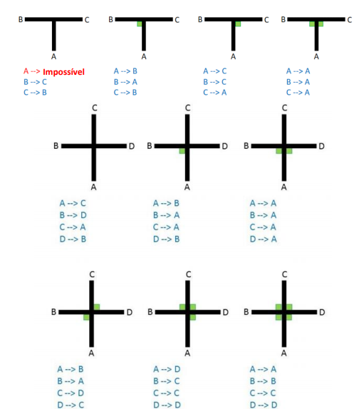

# OBR-2020
Robô para a OBR de 2020


## Estrutura

A estrutura do robô pode ser encontrada no link a seguir: _https://www.tinkercad.com/things/atXvg4NdNgS-cool-stantia-wolt._

## Componentes eletrônicos

- (x1) Arduino Mega;
- (x1) Raspberry Pi;
- (x1) Camêra para Raspberry Pi;
- (x2) Ponte H L298N;
- (x2) TCS230;
- (x1) Matriz IR;
- (x1) Sharp IR;
- (x4) Ultrassônico;
- (x4) Motores DC com caixa de redução;
- (x1) Bateria Bateria polímero de lítio;
- (X1) Power Bank.

## Código

O código está sendo escrito em duas linguagens. Python3(Resgate) e C++(Seguidor de Linha e Desvio de Obstáculo).

### Resgate

#### Vitimas
Para a identificação das vitimas estamos utilizando a biblioteca de visão computacional OpenCV com técnicas de segmentação por borda.

Este é o método para a identificação das vitimas, que retorna uma tupla contendo o par ordenado da posição do centro do circulo e a magnitude do raio.
```python
circle(img, dp, minDist, param_1, param_2, minR, maxR)
```
- _img_:

A imagem que será feita a leitura dos circulos.

- _dp_:

Parâmetro que vota se a imagem apresenta ou não um circulo.

- _minDist_:

Valor mínimo para a distância entre os circulos

- _param_1_:

Valor passado na borda Canny.
```python
cv2.Canny(img, param_1, param_1/2)
```
- _param_2_: 

Valor do acumulador de threshold.

- _minR_:

Valor mínimo de busca do raio do círculo.

- _maxR_:

Valor máximo de busca do raio do círculo.

#### Parede

Com o objetivo de evitar a colisão entre o robô e a parede está sendo usado quatro sensores ultrassônicos. O código faz a varredura do valor dos sensores e se atingir o valor de corte é enviado um aviso para o robô, para que ele pare o atual movimento.

#### Triângulo

A ideia inicial é similar a detecção de vitimas, porém vamos procurar um retângulo.

#### Garra
Ainda em desenvolvimento.

#### Repositório
No último estágio do robô temos um "Guarda vitimas". No final as vitimas são descartadas na área de Resgate.

### Seguidor de Linha
Para o seguidor de linha o robô é dividido em duas etapas:

#### P.I.D.
Este é o algoritmo usado para que o robô realize a tarefa de seguir a linha. P -> Proporcional. I -> Integral. D -> Derivada. Ele diminui a oscilação na realização da tarefa, reduzindo erros e fornecendo estabilidade.

- _P(Proporcional)_:
Alcança o 'setpoint' multiplicando uma constante(KP) pela leitura atual do sensor.
- _I(Integral)_:
Diminui a oscilação do controlador _P_ multiplicando por uma constante(KI) a somatória do ERRO(SetPoint - Valor_De_Leitura_Atual).
- _D(Derivada)_:
Atinge o objetivo do _I_ de maneira mais veloz, calculando a taxa de variação da leitura no tempo e multiplicando por uma constante(KD).

```cpp
 double error = IDEAL - analogRead(A0);
  
  P = KP * error;
  I += KI * error;
  D = KD * ((analogRead(A0) - lastMeasure)/(millis() - lastTime));

  double PID = P+I+D;

  lastMeasure = analogRead(0);//trocar pelo sensor IR[N]
  lastTime = millis();
```
**_Implementação do Algoritmo PID_**.


Este algoritmo está implementado com a matriz IR, que realiza a leitura da linha com base na taxa de reflexão da luz infravermelha emitida por um LED da placa.

#### Intersecções e beco sem saída
No circuito o robô deve obedercer os seguintes casos condicionais:

**_Retirado do manual oficial da OBR:_** _<http://www.obr.org.br/manuais/OBR2019_MP_ManualRegionalEstadual.pdf>_

Para a detecção do quadrado verde estamos usando o sensor TCS230.

### Desvio de Obstáculo
Para o desvio optamos utilizar o Sharp IR para a leitura da parede. O desenho do robô favorece para que ele ande para todos os lados, assim a programação do artefato nesta etapa não fica complicada, pois ele apenas anda para um dos lado(sendo escolha da equipe, tomando como interpretação o regulamento da OBR), segue em frente e anda para o lado contrário da primeira etapa deste procedimento.